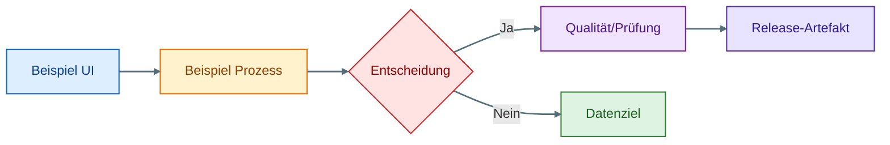

# DOKUMENTATION_DIAGRAMME

Dieses Verzeichnis bündelt die ausgelagerten Mermaid-Quellen und die daraus erzeugten SVG-Grafiken für den LEK-Bastler.

## Speicherort

- `docs/diagramme/`

## Enthaltene Dateien

### Grafikdateien (SVG)

- `docs/diagramme/anwender_ablauf.svg`
- `docs/diagramme/technik_systemuebersicht.svg`
- `docs/diagramme/release_pipeline.svg`

### Quell-Dateien (Mermaid)

- `docs/diagramme/anwender_ablauf.mmd`
- `docs/diagramme/technik_systemuebersicht.mmd`
- `docs/diagramme/release_pipeline.mmd`

## Einbindung in die Dokumentation

- Anwenderfluss: `docs/DOKUMENTATION_ANWENDER.md`
- Techniküberblick: `docs/DOKUMENTATION_TECHNIK.md`
- Release-Ablauf: `docs/DOKUMENTATION_RELEASES.md`

## Empfohlene Positionierung (aktueller Stand)

- `anwender_ablauf.svg`
  - Position: direkt nach Abschnitt **Typischer Ablauf** in `docs/DOKUMENTATION_ANWENDER.md`
  - Zweck: Schrittfolge Auswahl → Freigabe → Export visuell verdichten
- `technik_systemuebersicht.svg`
  - Position: direkt nach Abschnitt **Pfadkonzept/Systemübersicht** in `docs/DOKUMENTATION_TECHNIK.md`
  - Zweck: Modul- und Datenflüsse inkl. Wizard/ImportSession auf einen Blick
- `release_pipeline.svg`
  - Position: direkt nach Abschnitt **GitHub Release-Workflow** in `docs/DOKUMENTATION_RELEASES.md`
  - Zweck: Build-, QA- und Publishing-Kette transparent machen

## Visuelle Legende (einheitlich)

Die Mermaid-Quellen nutzen ein gemeinsames Farbschema und Klassenmodell:

- `ui` = Benutzeroberfläche / Steuerung
- `process` = Verarbeitung / Modul-Logik
- `quality` = Prüfung / Freigabe / QA
- `decision` = Entscheidung / Gating
- `data` = Dateien, Ordner, Konfigurationen
- `release` = Build-/Release-Artefakte

## Starter-Snippet für neue Diagramme

Für neue Mermaid-Diagramme kann dieses kompakte Grundgerüst direkt übernommen werden:

Hinweis: `linkStyle` mit `stroke` und `stroke-width` ist bewusst mermaid-cli-kompatibel gehalten.

### Mini Do/Don’t (Render-stabil)

- ✅ Do: In `linkStyle` nur `stroke` und `stroke-width` verwenden.
- ✅ Do: Einrückungen mit Spaces statt Tabs schreiben (auch im Mermaid-Codeblock).
- ✅ Do: Klassen (`classDef`) zentral definieren und per `class ...` zuweisen.
- ❌ Don’t: `color` in `linkStyle` nutzen (führt in mermaid-cli häufig zu Parse-Fehlern).
- ❌ Don’t: Mischformatierung aus Tabs/Spaces verwenden.
- ❌ Don’t: Nicht validierte Stilattribute „auf Verdacht“ einführen.

## Hinweis

Die Mermaid-Dateien sind die pflegbaren Quellen. Die SVG-Dateien dienen als direkt einbindbare Grafiken für GitHub, VS Code und Release-Dokumentation.
