# DOKUMENTATION_RELEASES

## Ziel

Diese Dokumentation beschreibt den standardisierten Build- und Release-Ablauf für den LEK-Bastler.

## Versionierungsquelle

- Maßgeblich ist `src/build_version_info.txt` (`FileVersion`)
- Git-Tags für Releases folgen dem Format `vMAJOR.MINOR.PATCH`
- Tag und `FileVersion` müssen exakt übereinstimmen

## Build-Artefakte

Nach `src/build.ps1` entstehen:

- EXE (Zwischenartefakt): `dist/LEK-Bastler.exe`
- Deploy-Ordner: `dist/LEK-Bastler_<Version>/`
- Deploy-EXE: `dist/LEK-Bastler_<Version>/LEK-Bastler_<Version>.exe`
- Release-ZIP: `release/LEK-Bastler_<Version>.zip`
- Release Notes: `release/RELEASE_NOTES_v<Version>.md`

## GitHub Release-Workflow

Workflow-Datei: `.github/workflows/release.yml`

Der Workflow:

1. Liest Version aus `src/build_version_info.txt`
2. Prüft Tag-Format und Versionsgleichheit
3. Führt `src/setup.ps1` und `src/build.ps1` aus
4. Veröffentlicht EXE, ZIP und Release-Notes als Assets
5. Erstellt/aktualisiert Release-Titel im Produktschema

Release-Titel-Schema:

- `LEK-Bastler v...`

## Checkliste vor Release

1. `docs/CHANGELOG` bzw. Projektdokumentation aktualisieren
2. Regressionstest-Suite ausführen (`tools/test_regression_core.py`)
3. Smoke-Test gemäß `docs/RELEASE_QA_CHECKLISTE.md`
4. Commit/Push auf `main`
5. Tag setzen und pushen (`vX.Y.Z`)

## Hinweise

- Release Notes werden pro Version automatisch erzeugt und als Release-Body genutzt.
- Der Workflow ist absichtlich strikt, um Versionsdrift zwischen Tag und Binärversion zu verhindern.
