# DOKUMENTATION_TECHNIK

## 1. Komponenten

- GUI: `src/main.py` (tkinter/ttk)
- Extraktion/Export: `src/word_processor.py`
- Vorlagenlogik: `src/template_manager.py`
- Selektion: `src/task_selector.py`
- Anwendungssymbol: `src/app_icon.ico`

Aktueller Versionsstand: **3.7.0**.

## 2. Build-Konfiguration

- Spec: `src/LEK-Bastler.spec`
  - Entry: `src/main.py`
  - Pathex: `src`
  - Icon: `src/app_icon.ico`
  - Datas: `data`, `src/app_icon.ico`
  - EXE-Basisname: `LEK-Bastler`

- Build-Skript: `src/build.ps1`
  - Setup-Skript: `src/setup.ps1` (venv + Abhängigkeiten aus `src/REQUIREMENTS.txt`)
  - Führt PyInstaller aus
  - Erzeugt versionierten Deploy-Ordner `dist/LEK-Bastler_<Version>`
  - Erzeugt versionierte EXE `LEK-Bastler_<Version>.exe`
  - Erzeugt versioniertes ZIP in `release/LEK-Bastler_<Version>.zip`
  - Nutzt .NET-ZIP-Erstellung (`ZipFile.CreateFromDirectory`) für zuverlässige Inhalte

## 3. Pfadkonzept

- Entwicklungsmodus: Pfade relativ zu `__file__` in `src/`
- EXE-Modus: Pfade relativ zu `sys.executable` (Deploy-Ordner)
- Icon-Fallback bei PyInstaller: `sys._MEIPASS`
- Exportziel: Verzeichnis `data/LEKs/` (wird bei Bedarf automatisch angelegt)

## 3a. Systemübersicht

Die Grafik zeigt die zentralen Quellmodule, die Konfigurationsdaten und den Exportpfad des LEK-Bastler.
Zusätzlich werden die ImportSession-/Wizard-Kopplung sowie der Regressionseinstieg auf Modulebene sichtbar gemacht.

## 4. Inhaltserhaltung beim Export

- Übernahme der Aufgabenstrukturen inklusive Tabellen
- Erhaltung von Formatierungsinformationen
- Übernahme von Inhaltssteuerelementen (SDT)
- Kontextabgleich zwischen Quelle und Zielvorlage (Styles/Nummerierung)

## 4a. Wizard-Vorschau und Exportkopplung

- Der Wizard arbeitet mit einer persistenten `ImportSession`; zwischen Schritt 3 und 4 erfolgt keine Re-Extraktion.
- Exportiert werden ausschließlich die freigegebenen Aufgaben aus `approved_task_ids` bzw. den bestätigten Raw-Tasks.
- Hauptaufgaben und Unteraufgaben werden über die führende Hauptnummer gruppiert (z. B. `1.0`, `1.1`, `1.2` → Gruppe `1`). Freigabe und Export erweitern eine Auswahl deshalb automatisch auf alle Aufgaben derselben Gruppe.
- Für strukturierte Aufgaben-Tabellen wird dieselbe fachliche Reihenfolge für Vorschau und Export verwendet:
  - Titel
  - Intro/Einleitung (optional)
  - Aufgabenstellung
  - Hinweis (optional)
  - Punkte (optional)
- Die Schritt-3-`Gesamtausgabe prüfen`-Vorschau in `src/main.py` nutzt dieselbe zentrale Fließtext-Logik wie der Exportpfad in `src/word_processor.py`.
- Ein zusätzlicher Delta-Check markiert fehlende optionale Blöcke transparent, ohne den Exportinhalt künstlich zu verändern.

Technische Umsetzung der Gruppenlogik:

- `ImportTask` in `src/import_wizard.py` führt dafür einen `group_key`, der aus `number_display` bzw. der Hauptnummer abgeleitet wird.
- `ImportSession.set_task_approvals(...)` setzt Freigaben gruppenweise und hält `approved_task_ids` konsistent.
- `src/main.py` erweitert markierte Aufgaben vor Freigabe und `export_selected()` automatisch auf die vollständige Aufgabenfamilie.

## 4a.1 Externe Tabellenreferenzen und Orientierungswahl

- `src/word_processor.py` erkennt Marker wie `<<tabelle=Dateiname>>` und optional `<<tabelle_format=auto|portrait|landscape>>` direkt im Aufgabeninhalt.
- Die referenzierte Datei wird relativ zur geladenen Aufgabensammlung aufgelöst:
  - Basisordner: `data/Aufgaben/`
  - Unterordner: aus dem Sammlungsnamen ohne Präfix `Aufgaben_`, `Aufgaben-` oder dem Präfixwort `Aufgaben` abgeleitet
- Die Marker werden aus `task['content']` entfernt und als Metadaten (`external_table_reference`, `external_table_path`, `external_table_orientation`) an der Aufgabe gespeichert.
- Beim Export wird das externe Dokument geladen, seine Orientierung heuristisch ermittelt (oder per Override erzwungen) und über neue Word-Sektionen in Hoch- bzw. Querformat eingebettet.
- Fehlende Referenzen erzeugen eine Diagnosewarnung und blockieren – sofern konfiguriert – den Export in `src/main.py`.

## 4b. Regelwerk und Konfiguration (Sprint 2)

Zentrale Regelquelle ist `data/config/import_rules.json`.

Wesentliche Bereiche:

- `field_alias_rules`
  - `structured_task_fields`: kanonische Felder mit Aliaslisten (z. B. Intro/Hinweis/Schlagworte).
  - `labels`: zentrale Feldbezeichnungen für Warnungen und Tabellen-Mapping.
- `preview_rules`
  - `task_flow_sections`: feste Reihenfolge und Optionalität für Vorschau/Export-Fließtext.
  - `optional_sections` + `show_optional_missing_sections`: steuert Delta-Hinweise in der Vorschau.
- `template_rules`
  - `required_fields` + `block_export_on_missing_required` für Pflichtfeldprüfung.
- `category_rules`
  - `required`, `missing_values`, `block_export_on_missing`.
- `difficulty_rules`
  - `allowed_values`, `aliases`, `block_export_on_inconsistent`.
- `duplicate_rules` (+ kompatible Legacy-Keys)
  - Modus-/Schwellwertsteuerung für Duplikatprüfung.
- `default_import_metadata`
  - GUI-Defaults für Kategorie, Schwierigkeitsgrad, Schlagworte, Titel.
- `export_rules.title_points_box`
  - Feintuning für Punkte-Box am Titelende (`min_inner_width`, `padding_spaces`).

Technische Leitlinie:

- Fachliche Entscheidungen erfolgen über `WordProcessor.get_import_rule(...)`.
- Harte Aliaslisten im Verarbeitungs- und Vorschaupfad wurden durch regelbasierte Resolver ersetzt.
- GUI und Backend verwenden dieselben Difficulty-Aliasregeln aus der Konfiguration.

## 4c. Parser-Pipeline und Erkennungsmodi (Sprint 3)

`src/word_processor.py` trennt den Extraktionspfad in klarere Stufen:

1. **Strukturerkennung**

- `_extract_tasks_from_headings(...)` für H1/H2-Dokumente.
- `_extract_tasks_from_structured_tables(...)` für strukturierte Tabellen.

1. **Modus-/Fallback-Auswahl**

- `_extract_tasks_with_parser_mode(...)` steuert Priorität/Fallback.
- Konfigurierbar über `parser_rules` in `import_rules.json`.

1. **Normalisierung**

- `_normalize_task_collection(...)` bündelt Difficulty/Keyword/Nummern-Normalisierung.

`parser_rules`:

- `mode`: `auto` | `headings` | `tables` | `mixed`
- `prefer_mode_on_mixed`: `headings` oder `tables`
- `fallback_to_secondary_on_empty`: aktiviert Fallback auf sekundären Modus
- `include_secondary_in_mixed`: kombiniert beide Modi bei gemischten Dokumenten

Standardverhalten (`auto`) bleibt kompatibel:

- H1/H2 wird bevorzugt.
- Tabellenmodus greift als Fallback, wenn H1/H2 keine Aufgaben liefert.

## 4d. Regressionstests und Release-QA (Sprint 4)

- Regressionstest-Suite: `tools/test_regression_core.py`
  - Kernfälle R1–R6 (Vorschau/Export-Reihenfolge, Delta-Check, Kategoriepflicht,
    Titel-Fallback, Difficulty-Blockade, Teilfreigabe).
  - Zusätzlich abgesichert: gruppierte Freigabe und gruppiertes Entfernen für Haupt-/Unteraufgaben.
  - Zusätzlich abgesichert: lernbereichsspezifische Auflösung externer Tabellenreferenzen und Querformat-Übernahme beim Export.
- Testfallmatrix: `memos/MEMO_REGRESSIONSTEST_MATRIX.md`
- Release-QA-Checkliste: `docs/RELEASE_QA_CHECKLISTE.md`

Empfohlener lokaler Testlauf vor Release:

- Python-Umgebung aktivieren
- Regressionstests ausführen
- Smoke-Checkliste vollständig durchlaufen

## 5. Konventionen

- Source-Dateien liegen unter `src/`
- Laufzeitdaten (`data/Aufgaben`, `data/Vorlagen`, `data/LEKs`) liegen unter `data/`
- Build-Artefakte liegen unter `dist/` und `release/`
- Anwenderdoku und technische Doku liegen unter `docs/`

## 6. Verteilungsoptionen

Aus den historischen Dokumenten übernommen und auf aktuellen Stand angepasst:

- Windows-Release als Release-ZIP (primärer Weg)
- Lokales Build für interne Tests
- Netzwerkbereitstellung des entpackten Release-Ordners

## 7. Regression-Checkliste

1. `src/build.ps1` erfolgreich
2. `dist/LEK-Bastler_<Version>/` vollständig
3. `release/LEK-Bastler_<Version>.zip` vollständig
4. EXE-Icon korrekt
5. GUI-Fenstericon korrekt
6. Exportfunktion erstellt Word-Datei unter `data/LEKs/`
7. Vorlagenersetzung und Aufgabenübernahme fachlich plausibel
